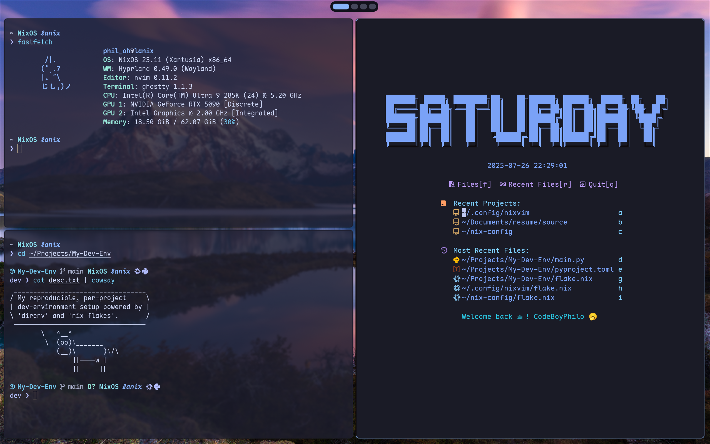

# Philo's Nix-Config

<p align="center">
  
</p>

This repo contains my personal nix-config for nix-darwin, home-manager, and NixOS.
It is intended for cross-platform quick deployment of my dev environment.

> My config is based on and is heavily influenced by [whimpy's config](https://github.com/wimpysworld/nix-config).

# A glance at my rice 🍚
[assets/my-rice.png](https://github.com/user-attachments/assets/d26cc2cb-75c0-4d6c-9f81-36d3e416bc20)

# Home-Manager
The home-manager configs are modularised and classified into one of the following:
- `cli-tools`
    - `core` tools which are included for all machines
    - `add-on` tools which are nice-to-have tools that are ignored on VMs
- `fonts`, which installs fonts and declares which fonts to be used
- `nixvim`, which applies my custom [Nixvim configs](https://github.com/CodeBoyPhilo/Nixvim-Config.git)
- `platforms`, per-platform setup that differs across OS'es
    - `macos` configs for macOS programs (some are not available as a home-manager module but are installed via homebrew in [nix-darwin](nix-darwin/default.nix))
    - `nixos` configs for NixOS, where a majority of my rice configs reside (e.g. hyprland)
- `shell` that contains configs for `bash`, `zsh`, and the `starship` prompt. 
    - I mainly use `zsh` as a daily driver. `bash` is included as a placeholder to avoid potential issues with bash configs not being managed with home-manager.
- `stylix` which applies unified themes to supported programs
- `wallpapers` which contains a set of wallpapers that are more relevant to my Linux machines
     
# Nix-Darwin
My nix-darwin configs are organised in a similar manner to my home-manager configs but also have per-machine setup (e.g. install ChatGPT only on M-chips)
- `appearance` that sets a wallpaper 
- `booster` that contains a set of apps that boost productivity
- `creativity` apps, which are really just Obsidian and Microsoft Office
- `social` apps such as WeChat and Discord

# NixOS
My NixOS configs are sorted into:
- `apps` as a general category
- `services` for system services
- `system` settings such as bluetooth and nvidia drivers

# Example Usage
- Apply home-manager config
```bash
home-manager switch --flake .#username@hostname
```

- Apply nix-darwin config (may require `sudo` privilege)
    - for the first time, run:
    ```bash
    nix build .#darwinConfigurations.hostname.system
    ./result/sw/bin/darwin-rebuild switch --flake .#hostname
    ```
    - after that, you can use:
    ```bash
    darwin-rebuild switch --flake .#hostname
    ```
- Apply nixos config
```bash
sudo nixos-rebuild switch --flake .#hostname
```
> [!NOTE]
> On NixOS, I use [`nh`](https://github.com/nix-community/nh.git) to replace `home-manager switch` and `nixos-rebuild switch`


